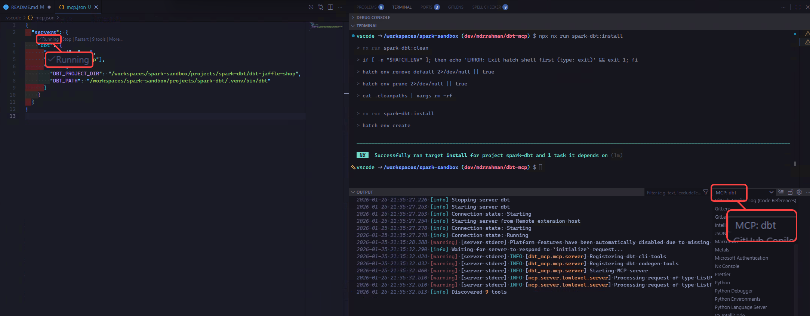
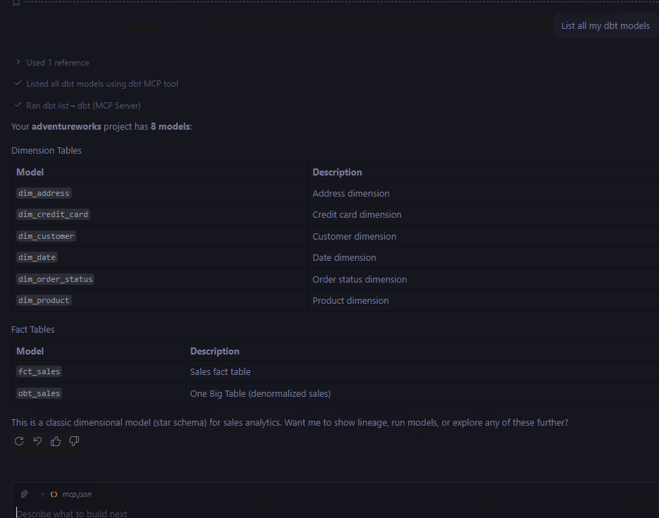

<!-- PROJECT LOGO -->
<p align="center">
  
  <h3 align="center">Spark - dbt</h3>
  <p align="center">
    Data transformation for Spark and Fabric using dbt.
    <br />
    <br />
    <a href="https://docs.getdbt.com/">dbt Docs</a>
    ·
    <a href="https://github.com/mdrakiburrahman/dbt-fabricspark/tree/dev/mdrrahman/explore">dbt Adapter - fork for now</a>
    ·
    <a href="https://docs.getdbt.com/docs/core/connect-data-platform/fabricspark-setup">dbt-fabricspark setup docs</a>
    ·
    <a href="https://docs.getdbt.com/reference/resource-configs/fabricspark-configs">dbt-fabricspark config docs</a>
  </p>
</p>

---

<div align="center">

• [PREREQUISITES](#📋-prerequisites)
• [USING DBT](#🚀-using-dbt)
• [DEPENDENCIES](#📦-dependencies)

</div>

## 📋 Prerequisites

Before you begin, ensure you are reading this from inside the VSCode devcontainer. If you haven't done so, please [bootstrap your devbox first](../../README.md).

To set up the Python environment and install dependencies, run:

```bash
npx nx run spark-dbt:install
```

## 🚀 Using dbt

```bash
export GIT_ROOT=$(git rev-parse --show-toplevel)
cd "${GIT_ROOT}/projects/spark-dbt"
hatch shell

dbt --version
```

Then browse each `dbt-...` project and follow the READMEs:

- [dbt-jaffle-shop](dbt-jaffle-shop/README.md) to test the simple Jaffle Shop simple dataset.
- [dbt-adventureworks](dbt-adventureworks/README.md) to test the Adventureworks Kimball STAR Schema dataset.

## 🤖 Using MCP

The following tutorials was used to setup an MCP server:

- [A Practical Guide to Setting Up dbt MCP Server with VS Code and Claude](https://medium.com/@rahulpdiggi/a-practical-guide-to-setting-up-dbt-mcp-server-with-vs-code-and-claude-539289ab739f)
- [Set up local MCP](https://docs.getdbt.com/docs/dbt-ai/setup-local-mcp)

This is the mcp package on [PyPi](https://pypi.org/project/dbt-mcp/).

To use it, first make sure `npx nx run spark-dbt:install` is done.

Then, start the MCP server by clicking "Start" in "/workspaces/spark-sandbox/.vscode/mcp.json", and you should see these logs:



And we can use it to invoke any of the 9 tools available to the dbt CLI:


