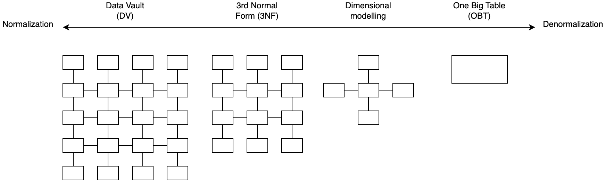
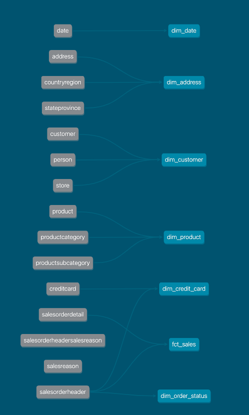
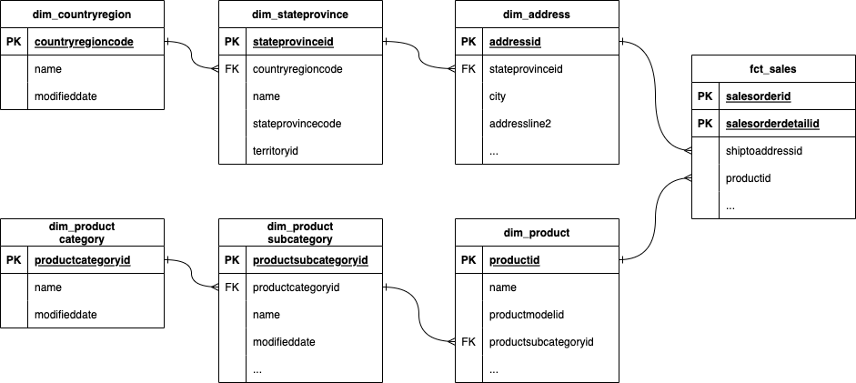
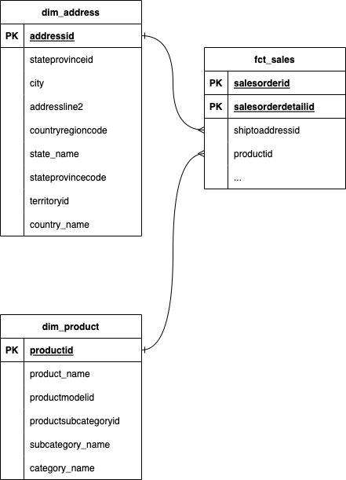
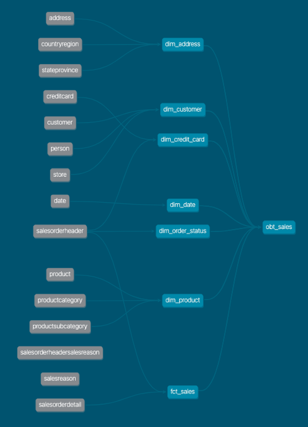

## Dimensional modelling dbt project: `adventureworks`

- [Website](https://docs.getdbt.com/blog/kimball-dimensional-model)
- [Code](https://github.com/mdrakiburrahman/dbt-dimensional-modelling)

## Introduction

Dimensional modelling is one of many data modelling techniques that are used by data practitioners to organize and present data for analytics. Other data modelling techniques include Data Vault (DV), Third Normal Form (3NF), and One Big Table (OBT) to name a few.


_Data modelling techniques on a normalization vs denormalization scale_

While the relevancy of dimensional modelling [has been debated by data practitioners](https://discourse.getdbt.com/t/is-kimball-dimensional-modeling-still-relevant-in-a-modern-data-warehouse/225/6), it is still one of the most widely adopted data modelling technique for analytics.

Despite its popularity, resources on how to create dimensional models using dbt remain scarce and lack detail. This tutorial aims to solve this by providing the definitive guide to dimensional modelling with dbt.

## Dimensional modelling

Dimensional modelling is a technique introduced by Ralph Kimball in 1996 with his book, [The Data Warehouse Toolkit](https://www.kimballgroup.com/data-warehouse-business-intelligence-resources/books/data-warehouse-dw-toolkit/).

The goal of dimensional modelling is to take raw data and transform it into Fact and Dimension tables that represent the business.



_Raw 3NF data to dimensional model_

The benefits of dimensional modelling are:

- **Simpler data model for analytics**: Users of dimensional models do not need to perform complex joins when consuming a dimensional model for analytics. Performing joins between fact and dimension tables are made simple through the use of surrogate keys.
- [**Don’t repeat yourself**](https://docs.getdbt.com/terms/dry): Dimensions can be easily re-used with other fact tables to avoid duplication of effort and code logic. Reusable dimensions are referred to as conformed dimensions.
- **Faster data retrieval**: Analytical queries executed against a dimensional model are significantly faster than a 3NF model since data transformations like joins and aggregations have been already applied.
- **Close alignment with actual business processes**: Business processes and metrics are modelled and calculated as part of dimensional modelling. This helps ensure that the modelled data is easily usable.

Now that we understand the broad concepts and benefits of dimensional modelling, let’s get hands-on and create our first dimensional model using dbt.

[Next &raquo;](docs/part01-setup-dbt-project.md)

## Environment setup

```bash
az login

export GIT_ROOT=$(git rev-parse --show-toplevel)
cd "${GIT_ROOT}/projects/spark-dbt/dbt-adventureworks"

export DBT_PROFILES_DIR=$(pwd)
export DBT_DEBUG=false

dbt debug
```

## Run

Install deps:

```bash
dbt deps

# 22:47:51  Installing dbt-labs/dbt_utils
# 22:47:52    Installed from version 1.0.0
# 22:47:52    Updated version available: 1.3.3
```

Seed database:

```bash
dbt seed
```


The Snowflake schema is as follows:



The STAR schema is as follows:



And the DBT DAG:



Here are the tables at this point:

```sql
SHOW ALL TABLES;

-- ┌────────────────┬────────────┬──────────────────────┬──────────────────────┬───────────────────────────────────────────────────────────────────────────────────────────┬───────────┐
-- │    database    │   schema   │         name         │     column_names     │                                       column_types                                        │ temporary │
-- │    varchar     │  varchar   │       varchar        │      varchar[]       │                                         varchar[]                                         │  boolean  │
-- ├────────────────┼────────────┼──────────────────────┼──────────────────────┼───────────────────────────────────────────────────────────────────────────────────────────┼───────────┤
-- │ adventureworks │ date       │ date                 │ [date_day, prior_d…  │ [DATE, DATE, DATE, DATE, DATE, INTEGER, VARCHAR, INTEGER, INTEGER]                        │ false     │
-- │ adventureworks │ person     │ address              │ [addressid, addres…  │ [INTEGER, VARCHAR, VARCHAR, VARCHAR, INTEGER, VARCHAR, VARCHAR, VARCHAR, TIMESTAMP]       │ false     │
-- │ adventureworks │ person     │ countryregion        │ [countryregioncode…  │ [VARCHAR, TIMESTAMP, VARCHAR]                                                             │ false     │
-- │ adventureworks │ person     │ person               │ [businessentityid,…  │ [INTEGER, VARCHAR, VARCHAR, VARCHAR, VARCHAR, VARCHAR, BOOLEAN, VARCHAR, TIMESTAMP, VAR…  │ false     │
-- │ adventureworks │ person     │ stateprovince        │ [stateprovinceid, …  │ [INTEGER, VARCHAR, TIMESTAMP, VARCHAR, VARCHAR, INTEGER, BOOLEAN, VARCHAR]                │ false     │
-- │ adventureworks │ production │ product              │ [productid, name, …  │ [INTEGER, VARCHAR, SMALLINT, BOOLEAN, VARCHAR, BOOLEAN, VARCHAR, SMALLINT, TIMESTAMP, V…  │ false     │
-- │ adventureworks │ production │ productcategory      │ [productcategoryid…  │ [INTEGER, VARCHAR, TIMESTAMP]                                                             │ false     │
-- │ adventureworks │ production │ productsubcategory   │ [productsubcategor…  │ [INTEGER, INTEGER, VARCHAR, TIMESTAMP]                                                    │ false     │
-- │ adventureworks │ sales      │ creditcard           │ [creditcardid, car…  │ [INTEGER, VARCHAR, SMALLINT, TIMESTAMP WITH TIME ZONE, SMALLINT, VARCHAR]                 │ false     │
-- │ adventureworks │ sales      │ customer             │ [customerid, perso…  │ [INTEGER, INTEGER, INTEGER, INTEGER]                                                      │ false     │
-- │ adventureworks │ sales      │ salesorderdetail     │ [salesorderid, ord…  │ [INTEGER, SMALLINT, INTEGER, 'DECIMAL(18,3)', INTEGER, TIMESTAMP, VARCHAR, INTEGER, 'DE…  │ false     │
-- │ adventureworks │ sales      │ salesorderheader     │ [salesorderid, shi…  │ [INTEGER, INTEGER, INTEGER, TIMESTAMP, VARCHAR, 'DECIMAL(18,3)', INTEGER, BOOLEAN, INTE…  │ false     │
-- │ adventureworks │ sales      │ salesorderheadersa…  │ [salesorderid, mod…  │ [INTEGER, TIMESTAMP, INTEGER]                                                             │ false     │
-- │ adventureworks │ sales      │ salesreason          │ [salesreasonid, na…  │ [INTEGER, VARCHAR, VARCHAR, TIMESTAMP]                                                    │ false     │
-- │ adventureworks │ sales      │ store                │ [businessentityid,…  │ [INTEGER, VARCHAR, INTEGER, TIMESTAMP]                                                    │ false     │
-- ├────────────────┴────────────┴──────────────────────┴──────────────────────┴───────────────────────────────────────────────────────────────────────────────────────────┴───────────┤
-- │ 15 rows                                                                                                                                                                 6 columns │
-- └───────────────────────────────────────────────────────────────────────────────────────────────────────────────────────────────────────────────────────────────────────────────────┘
```

Build the model:

```bash
dbt run
```

Test:

```bash
dbt test
```

Here are the tables at this point:

```sql
SHOW ALL TABLES;

-- ┌────────────────┬────────────┬──────────────────────┬──────────────────────┬──────────────────────────────────────────────────────────┬───────────┐
-- │    database    │   schema   │         name         │     column_names     │                       column_types                       │ temporary │
-- │    varchar     │  varchar   │       varchar        │      varchar[]       │                        varchar[]                         │  boolean  │
-- ├────────────────┼────────────┼──────────────────────┼──────────────────────┼──────────────────────────────────────────────────────────┼───────────┤
-- │ adventureworks │ date       │ date                 │ [date_day, prior_d…  │ [DATE, DATE, DATE, DATE, DATE, INTEGER, VARCHAR, INTEG…  │ false     │
-- │ adventureworks │ marts      │ dim_address          │ [address_key, addr…  │ [VARCHAR, INTEGER, VARCHAR, VARCHAR, VARCHAR]            │ false     │
-- │ adventureworks │ marts      │ dim_credit_card      │ [creditcard_key, c…  │ [VARCHAR, INTEGER, VARCHAR]                              │ false     │
-- │ adventureworks │ marts      │ dim_customer         │ [customer_key, cus…  │ [VARCHAR, INTEGER, INTEGER, VARCHAR, INTEGER, VARCHAR]   │ false     │
-- │ adventureworks │ marts      │ dim_date             │ [date_key, date_da…  │ [VARCHAR, DATE, DATE, DATE, DATE, DATE, INTEGER, VARCH…  │ false     │
-- │ adventureworks │ marts      │ dim_order_status     │ [order_status_key,…  │ [VARCHAR, SMALLINT, VARCHAR]                             │ false     │
-- │ adventureworks │ marts      │ dim_product          │ [product_key, prod…  │ [VARCHAR, INTEGER, VARCHAR, VARCHAR, VARCHAR, VARCHAR,…  │ false     │
-- │ adventureworks │ marts      │ fct_sales            │ [sales_key, produc…  │ [VARCHAR, VARCHAR, VARCHAR, VARCHAR, VARCHAR, VARCHAR,…  │ false     │
-- │ adventureworks │ marts      │ obt_sales            │ [sales_key, saleso…  │ [VARCHAR, INTEGER, INTEGER, 'DECIMAL(18,3)', SMALLINT,…  │ false     │
-- │ adventureworks │ person     │ address              │ [addressid, addres…  │ [INTEGER, VARCHAR, VARCHAR, VARCHAR, INTEGER, VARCHAR,…  │ false     │
-- │ adventureworks │ person     │ countryregion        │ [countryregioncode…  │ [VARCHAR, TIMESTAMP, VARCHAR]                            │ false     │
-- │ adventureworks │ person     │ person               │ [businessentityid,…  │ [INTEGER, VARCHAR, VARCHAR, VARCHAR, VARCHAR, VARCHAR,…  │ false     │
-- │ adventureworks │ person     │ stateprovince        │ [stateprovinceid, …  │ [INTEGER, VARCHAR, TIMESTAMP, VARCHAR, VARCHAR, INTEGE…  │ false     │
-- │ adventureworks │ production │ product              │ [productid, name, …  │ [INTEGER, VARCHAR, SMALLINT, BOOLEAN, VARCHAR, BOOLEAN…  │ false     │
-- │ adventureworks │ production │ productcategory      │ [productcategoryid…  │ [INTEGER, VARCHAR, TIMESTAMP]                            │ false     │
-- │ adventureworks │ production │ productsubcategory   │ [productsubcategor…  │ [INTEGER, INTEGER, VARCHAR, TIMESTAMP]                   │ false     │
-- │ adventureworks │ sales      │ creditcard           │ [creditcardid, car…  │ [INTEGER, VARCHAR, SMALLINT, TIMESTAMP WITH TIME ZONE,…  │ false     │
-- │ adventureworks │ sales      │ customer             │ [customerid, perso…  │ [INTEGER, INTEGER, INTEGER, INTEGER]                     │ false     │
-- │ adventureworks │ sales      │ salesorderdetail     │ [salesorderid, ord…  │ [INTEGER, SMALLINT, INTEGER, 'DECIMAL(18,3)', INTEGER,…  │ false     │
-- │ adventureworks │ sales      │ salesorderheader     │ [salesorderid, shi…  │ [INTEGER, INTEGER, INTEGER, TIMESTAMP, VARCHAR, 'DECIM…  │ false     │
-- │ adventureworks │ sales      │ salesorderheadersa…  │ [salesorderid, mod…  │ [INTEGER, TIMESTAMP, INTEGER]                            │ false     │
-- │ adventureworks │ sales      │ salesreason          │ [salesreasonid, na…  │ [INTEGER, VARCHAR, VARCHAR, TIMESTAMP]                   │ false     │
-- │ adventureworks │ sales      │ store                │ [businessentityid,…  │ [INTEGER, VARCHAR, INTEGER, TIMESTAMP]                   │ false     │
-- ├────────────────┴────────────┴──────────────────────┴──────────────────────┴──────────────────────────────────────────────────────────┴───────────┤
-- │ 23 rows                                                                                                                                6 columns │
-- └──────────────────────────────────────────────────────────────────────────────────────────────────────────────────────────────────────────────────┘
```

And we can see the DBT DAG for `obt_sales`:

```bash
dbt docs generate
dbt docs serve
```
