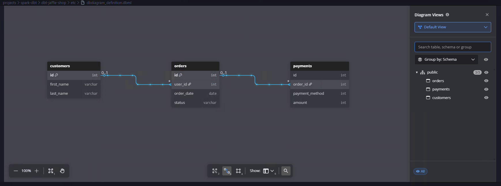

## Testing dbt project: `jaffle_shop`

`jaffle_shop` is a fictional e-commerce store. This dbt project transforms raw data from an app database into a customers and orders model ready for analytics.

### What is this repo?

What this repo _is_:

- A self-contained playground dbt project, useful for testing out scripts, and communicating some of the core dbt concepts.

What this repo _is not_:

- A tutorial — check out the [Getting Started Tutorial](https://docs.getdbt.com/tutorial/setting-up) for that. Notably, this repo contains some anti-patterns to make it self-contained, namely the use of seeds instead of sources.
- A demonstration of best practices — check out the [dbt Learn Demo](https://github.com/dbt-labs/dbt-learn-demo) repo instead. We want to keep this project as simple as possible. As such, we chose not to implement:
  - our standard file naming patterns (which make more sense on larger projects, rather than this five-model project)
  - a pull request flow
  - CI/CD integrations
- A demonstration of using dbt for a high-complex project, or a demo of advanced features (e.g. macros, packages, hooks, operations) — we're just trying to keep things simple here!

### What's in this repo?

This repo contains [seeds](https://docs.getdbt.com/docs/building-a-dbt-project/seeds) that includes some (fake) raw data from a fictional app.

The raw data consists of customers, orders, and payments, with the following entity-relationship diagram:



### Running this project

To get up and running with this project:

Test connectivity:

> Warning: flaky due to no Livy reuse, needs retries configured for the config
> Ensure you're logged into `az login` first

```bash
az login

export GIT_ROOT=$(git rev-parse --show-toplevel)
cd "${GIT_ROOT}/projects/spark-dbt/dbt-jaffle-shop"

export DBT_PROFILES_DIR=$(pwd)
export DBT_DEBUG=true

dbt debug
```

Load the CSVs with the demo data set. This materializes the CSVs as tables in your target schema. Note that a typical dbt project **does not require this step** since dbt assumes your raw data is already in your warehouse.

```bash
dbt seed
```

7. Run the models:

```bash
dbt run
```

> **NOTE:** If this steps fails, it might mean that you need to make small changes to the SQL in the models folder to adjust for the flavor of SQL of your target database. Definitely consider this if you are using a community-contributed adapter.

Test the output of the models:

```bash
dbt test
```

Generate documentation for the project:

```bash
dbt docs generate
```

View the documentation for the project:

```bash
dbt docs serve --port 18081
```

### What is a jaffle?

A jaffle is a toasted sandwich with crimped, sealed edges. Invented in Bondi in 1949, the humble jaffle is an Australian classic. The sealed edges allow jaffle-eaters to enjoy liquid fillings inside the sandwich, which reach temperatures close to the core of the earth during cooking. Often consumed at home after a night out, the most classic filling is tinned spaghetti, while my personal favourite is leftover beef stew with melted cheese.

---

For more information on dbt:

- Read the [introduction to dbt](https://docs.getdbt.com/docs/introduction).
- Read the [dbt viewpoint](https://docs.getdbt.com/docs/about/viewpoint).
- Join the [dbt community](http://community.getdbt.com/).

---
