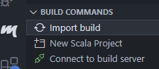

<!-- PROJECT LOGO -->

  
  <h3 align="center">Spark - Scala</h3>
  

    Orchestrating Stream and Batch Processing in Scala.
     
     
    <a href="https://spark.apache.org/">Spark Docs</a>
    ·
    <a href="https://github.com/apache/spark">Spark Source Code</a>
    ·
    <a href="https://learn.microsoft.com/en-us/azure/synapse-analytics/spark/apache-spark-overview">Synapse Spark Docs</a>
    ·
    <a href="https://learn.microsoft.com/en-us/fabric/data-engineering/runtime">Fabric Spark Docs</a>
  

---

• [PREREQUISITES](#📋-prerequisites)
• [DOCUMENTATION](#📚-documentation)

## 📋 Prerequisites

Before you begin, ensure you are reading this from inside the VSCode devcontainer. If you haven't done so, please [bootstrap your devbox first](../../README.md).

Open this folder you're currently in using the [spark.code-workspace](spark.code-workspace) to flatten the folder structure for [metals](https://scalameta.org/metals/) - a Scala Language Server; and click the metals extension (`m` icon) on the bottom left, to `Import build`, and get full intellisense:

To build and run the spark jobs, run: `npx nx run run` - see [run-spark-jobs.sh](.scripts/run-spark-jobs.sh) to pick and choose what you'd like to run.

## 📚 Documentation

Explore the [documentation root](./docs/README.md) for deep-dive into design and processes.
