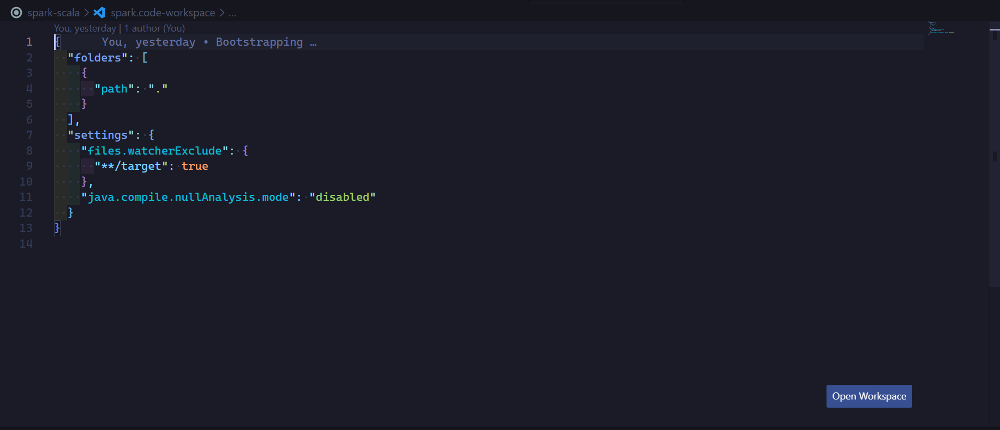
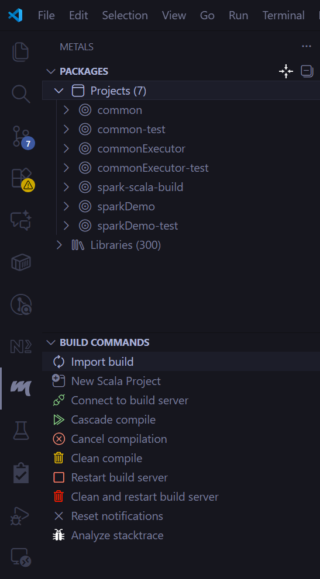
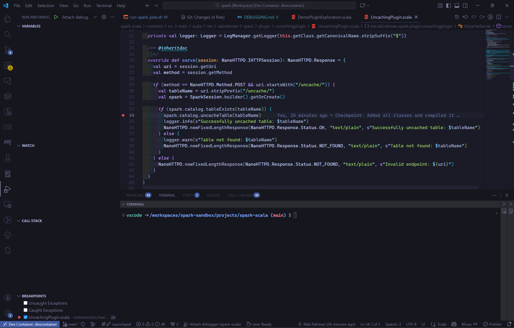
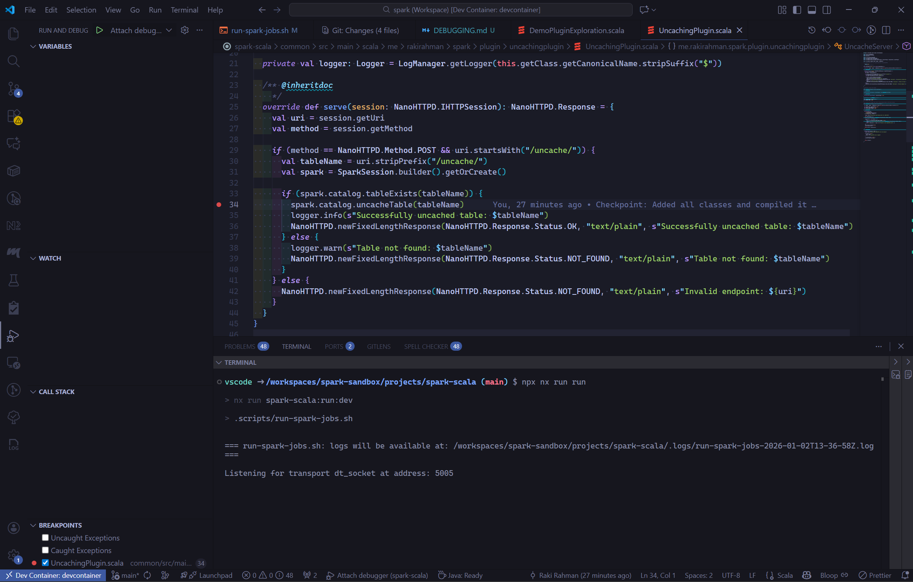
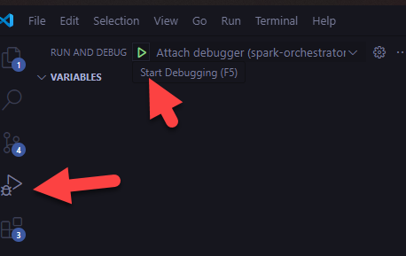
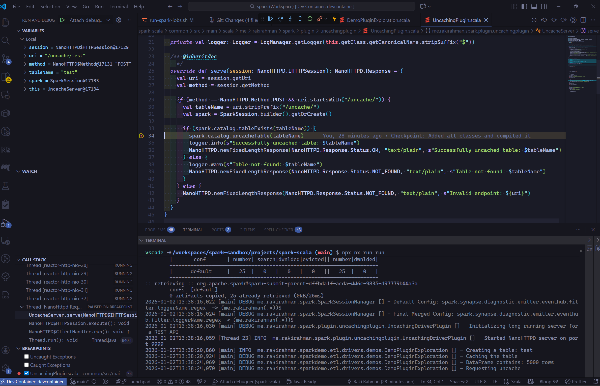

# 🐞 Debugging

- [Scala](#scala)
  - [Metals import](#metals-import)

## Scala

### Metals import

First and most importantly (❗), open VSCode within the `spark.code-workspace`:



> If you don't open in the Workspace view, you'll run into weird pathing issues.

Note that Metals path is case sensitive, these 2 things are NOT equal:

```bash
/workspaces/spark-sandbox/projects/spark-scala/projectB/src/main/scala/Main.scala
/workspaces/spark-sandbox/projects/spark-scala/projectb/src/main/scala/Main.scala
                                                          ^
```

If your project name is `projectA`, ensure it's stored in `spark-scala/projectA` as well.

Clean any `sbt` based builds, as they aren't debuggable, run `sbt clean`.

From metals, run `Clean compile` > `Import Build` to generate a clean debuggable build (uses [Bloop](https://scalacenter.github.io/bloop/)).

Once the build completes, you'll see an outline of your file:



### Spark Submitted Jobs using Java Debug Wire Protocol

[reference](https://sparkbyexamples.com/spark/how-to-debug-spark-application-locally-or-remote/)

We are using `nx run run` to invoke `run-spark-jobs.sh` script, and in that script, we use [`spark-submit`](https://spark.apache.org/docs/3.5.2/submitting-applications.html)
to submit Jobs into your Devcontainer Spark Cluster to run in a distributed setup (identical to what happens in the cloud).

Debugging this is possible via the [Java Debug Wire Protocol (JDWP)](https://en.wikipedia.org/wiki/Java_Debug_Wire_Protocol) - that connects
the `.jar` to your source code that built it.

To debug a `spark-submit`tted job, uncomment the following in `run-spark-jobs.sh`:

```bash
export SPARK_SUBMIT_OPTS="-agentlib:jdwp=transport=dt_socket,server=y,suspend=y,address=5005"
```

Then, uncomment the Driver you want to debug via `spark-submit`, say `me.rakirahman.sparkdemo.etl.drivers.demos.DemoPluginExploration`

Place your debugger wherever you want to pause:



Fire the nx target `nx run run`.

Spark will stop and listen on the port:



Attach your VSCode to the debugger port:



Debug away:



---

[Home](../README.md) > [Documentation](./README.md) > [Debugging](./DEBUGGING.md)
